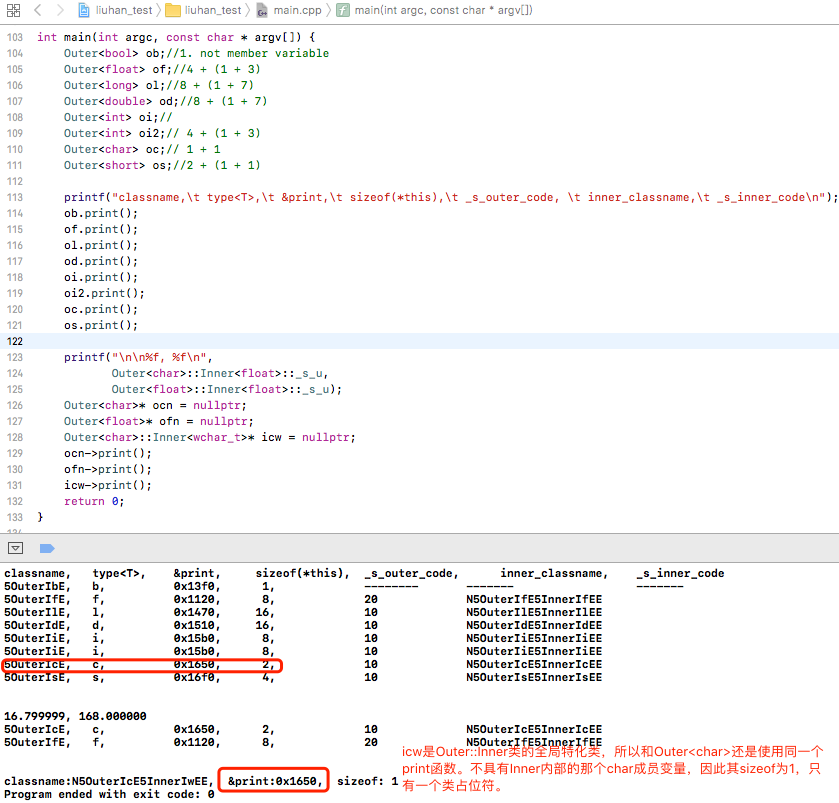
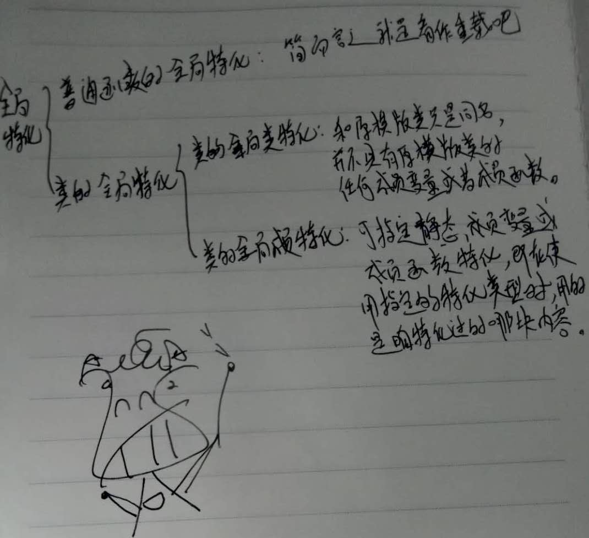

>准备抽空写一个简洁、极小的移动端渲染框架，名字就叫megranate_render吧@@。
第一步是需要一些vertex、matrix，不想用glm的，那就自己弄吧，方便以后做更多的控制。

```c++
template <typename T, unsigned intM, unsigned int N>
class MgMatrix {
public:
    T _datas[M][N];
};
```

1
=
我并不想实现每一个Mat2x2、Mat3x3、Mat4x4、...
因此我需要特化，
但是如果只是普通的全局类特化实现，就相当于每个不同M、N的类我又得各自暴力写一遍，这不是瞎折腾吗。
主要是不同M、N的类其带参数的构造函数不好一个模版搞定！
不过可以通过特化加宏的方式实现：
```c++
#define SpecializationInt(n) \
template<> \
class MgVertex<int, n> {\
public:\
int _datas[n];\
public:\
MgVertex() {\
for(unsigned int i = 0; i < _counts; i++){\
_datas[i] = 0;\
}\
}\
OperatorValueSpecializationI##n \
EndSpecializationI##n
```
在OperatorValueSpecializationI中实现不同参数的构造函数。


2
=
不过今天下午去乡村基吃晚饭的路上想了下使用嵌套类应该满足我的需求
```c++
template<typename T>
class Outer{
public:
  template<typename U>
  class Inner{
    };
};
```

3
=
测试程序
-
```c++
template<typename D, typename S>
D pointer_cast(S src){
    return *static_cast<D*>(static_cast<void*>(&src));
}

template<typename T>
class Outer{
public:
    template<typename U>
    class Inner{
    public:
        char _inner_code = 30;
        static U _s_u;
        void print(){
            printf("\t\t\t\t%s\n",
                   typeid(*this).name());
        }
    };
 
    void print(){
        void* p = pointer_cast<void*>(&Outer::print);
        printf("%s,\t %s,\t\t\t 0x%x,\t %2lu,\t\t\t %d",
               typeid(*this).name(), typeid(T).name(), p, sizeof(*this), _s_outer_code);
        print_inner();
    }
 
    void print_inner(){
        _inner.print();
    }
 
private:
    Inner<T> _inner;
    static short _s_outer_code;
    T _t;
};


template<typename T>
short Outer<T>::_s_outer_code = 10;

template<typename T>
template<typename U>
U Outer<T>::Inner<U>::_s_u = 168;
 

//--特化----------------
//--1.全局类特化----------------
template<>//全局类特化 !!!和原模版函数没什么关系了，
class Outer<bool>{//全新的一个同名类，不具有原模版函数的成员变量和成员函数.
public:
    template<typename U>
    class Inner{
    public:
        short _inner_code;
    };
    void print(){
        void* p = pointer_cast<void*>(&Outer::print);
        printf("%s,\t %s,\t\t\t 0x%x,\t %2lu,\t\t\t --------\t\t-------\t\t\t\t\t -------\n",
               typeid(*this).name(), typeid(bool).name(), p, sizeof(*this));
    }
};

template<>
template<>//全局类特化
class Outer<char>::Inner<wchar_t>{
public:
    void print(){
        void* p = pointer_cast<void*>(&Outer::print);
        printf("\n\nclassname:%s,  &print:0x%x,  sizeof:%2lu\n",
               typeid(*this).name(), p, sizeof(*this));
    }
};

//--2.全局成员特化----------------
//模版的静态成员和成员函数可做全局成员特化。
template<>//全局成员特化
short Outer<float>::_s_outer_code = 20;//

template<>
template<>//全局成员特化
float Outer<char>::Inner<float>::_s_u = 16.8;

template<>//全局成员特化
void Outer<float>::print(){//任具有原模版函数的成员变量和成员函数.
    void* p = pointer_cast<float*>(&Outer::print);
    printf("%s,\t %s,\t\t\t 0x%x,\t %2lu,\t\t\t %d",
           typeid(*this).name(), typeid(float).name(), p, sizeof(*this), _s_outer_code);
    print_inner();
}
```

4
=
运行结果
-
 

5
=
总结
-
* 类的全局类特化相当于和原模版类只是同名而已，并不具有原模版类的任何成员变量或成员函数。
* 类的全局成员特化可指定静态成员变量和成员函数的特化，即在使用指定的特化类型时候用的是特化过的指定内容。
* 普通函数的全局特化相当于重载的函数，与原函数处类名字和参数个数相同也没什么其他关联了。

 