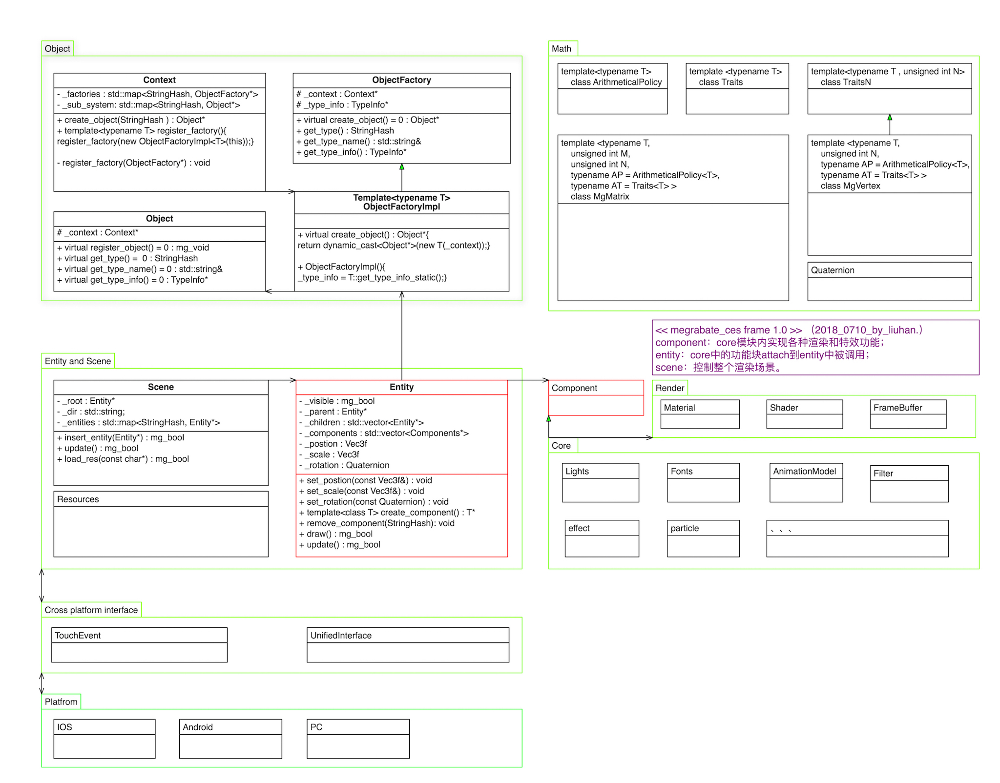

frame
=

## 目录：

c++
=
* [2018_0729_可变参数模板](./c++/2018_0729_可变参数模板/2018_0729_可变参数模板.md)
* [2018_0729_初始化列表](./c++/2018_0729_可变参数模板/2018_0729_初始化列表.md)
* [2018_0718_高斯函数](./c++/2018_0718_高斯函数/2018_0718_高斯函数.md)
* [2018_0707_使用特化实现我的万能vertex](./c++/2018_0707_万能vertex/万能vertex.md)
* [2018_0707_偏特化](./c++/2018_0705_全局特化/2018_0707_偏特化.md)
* [2018_0705_全局特化](./c++/2018_0705_全局特化/2018_0705_全局特化.md)

render
=
