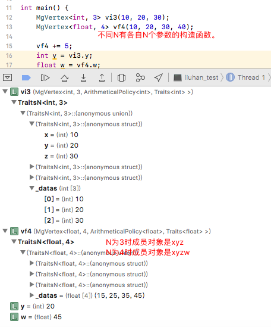
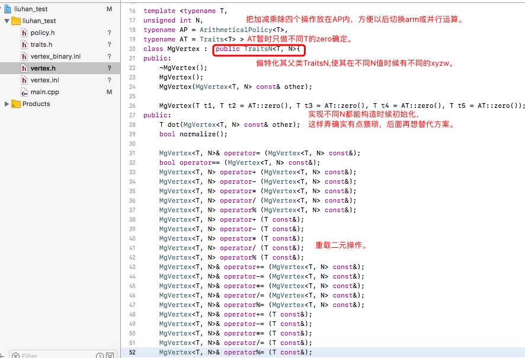

我想实现一个万能vertex,她需要满足：
-
1. 只需要实现一个模版类template <typename T, unsigned int N> class MgVertex；
2. 我可以得到任意类型T和任意个成员对象数量N的vertex的组合;
3. 不同数量N的vertex有带N个参数的构造函数；
4. 成员对象最好不是简单的 T _data[N]，可以这样:
```c++ 
union{
        struct{T x, y, z, ...;};
        struct{T r, g, b, ...;};
        struct{T q, s, t, ...;};
        T _datas[N];
    };
```
结果
-


实现：
=


偏特化实现需求4:
-
```c++ 

template<typename T , unsigned int N>
class TraitsN{
public:
    T* _datas;
};

template<typename T>
class TraitsN<T, 3>{
public:
    union{
        struct{T x, y, z;};
        struct{T r, g, b;};
        struct{T q, s, t;};
        T _datas[3];
    };
};

template<typename T>
class TraitsN<T, 4>{
public:
    union{
        struct{T x, y, z, w;};
        struct{T r, g, b, a;};
        struct{T q, s, t, p;};
        T _datas[4];
    };
};
```


不同T的zero:
-
```c++ 
template <typename T>
class Traits;

template<>
class Traits<float>{
public:
    typedef float TraitsType;
    static TraitsType const zero(){ return 0.0f;}
    //一般在类内部只能对整形或枚举类型初始化静态成员变量，所以使用静态函数。
};

template<>
class Traits<int>{
public:
    typedef int TraitsType;
    static TraitsType const zero(){ return 0;}
};

template<>
class Traits<double>{
public:
    typedef double TraitsType;
    static TraitsType const zero(){ return 0.0;}
};
```

more:
-
```c++
template <typename T,
unsigned int N,
typename AP = ArithmeticalPolicy<T>,//以后优化运算的扩展
typename AT = Traits<T> >//traits
class MgVertex :  public TraitsN<T, N>{
    MgVertex(T t1, T t2 = AT::zero(), T t3 = AT::zero(), T t4 = AT::zero(), T t5 = AT::zero());
};
//继承TraitsN

```

* vertex.h
* vertex.inl
* traits.h
* policy.h
* vertex_binary.inl
