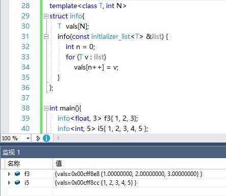

>1，传统 C++中，普通数组、没有构造析构和虚函数的类或结构体都可以使用 {} 进行初始化，也就是我们所说的初始化列表。
```c++
int arr[3] = { 1,2,3 }; // 列表初始化
class Foo{
private:
    int value;
public:
    Foo(int) {}
};
Foo foo(1); // 普通构造初始化
```

>2，
C++11将初始化列表解释成一个initializer_list<T>类型的变量（T是列表中元素的类型）。
它相当于一个只读的容器，只有三个成员函数：size()，begin()和end()。

```c++
int static_arr[5] = { 1, 2, 3, 4 };
int static_arr2[]{ 1, 2, 3, 4 }; // 等号要以省略
int* dynamic_arr = new int[5]{ 1, 2, 3, 4 };
vector<int> stl_vec{ 1, 2, 3, 4 };
set<int> stl_set{ 1, 2, 3, 3 };
map<const char*, int> stl_map
{
    { "Alice", 1 },
    { "Bob", 2 },
    { "Cindy", 3 }
};
```
>3,我的matrix类为了实现任意m*n的矩阵成员初始化之前使用了默认参数构造函数，该方法不优美。可以考虑初始化列表实现。
```c++
        MgMatrix(T t1, T t2, T t3, T t4,
        T t5 = AT::zero(), T t6 = AT::zero(), T t7 = AT::zero(), T t8 = AT::zer(),T t9 = AT::zero(), T t10 = AT::zero(), T t11 = AT::zero(), T t12 = AT::zero(),T t13 = AT::zero(), T t14 = AT::zero(), T t15 = AT::zero(), T t16 = AT::zero());
```
