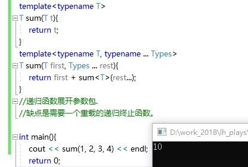
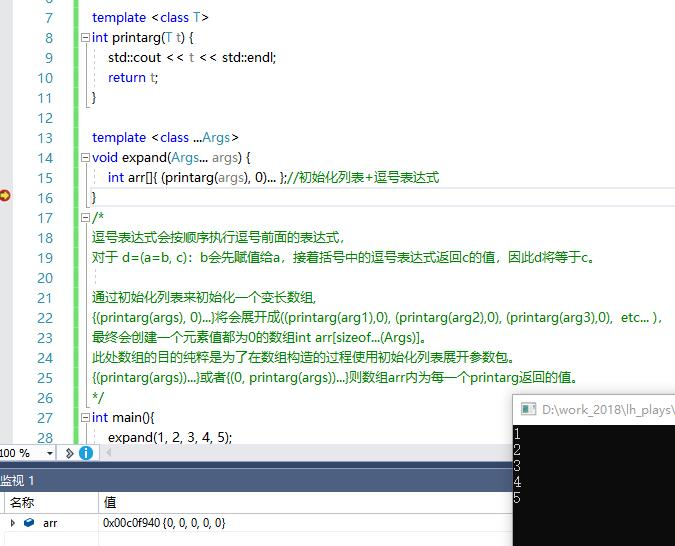
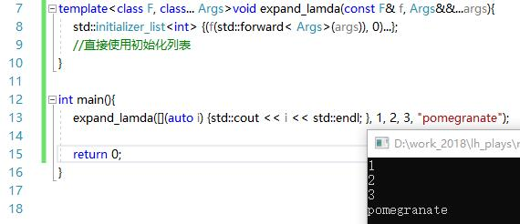
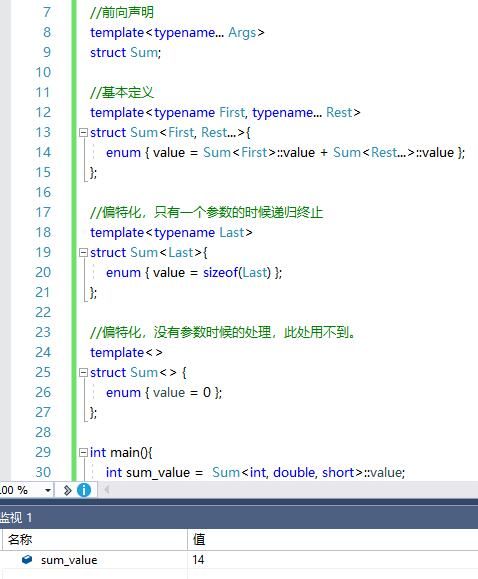
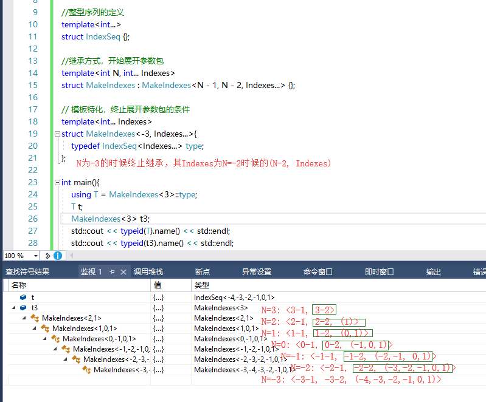
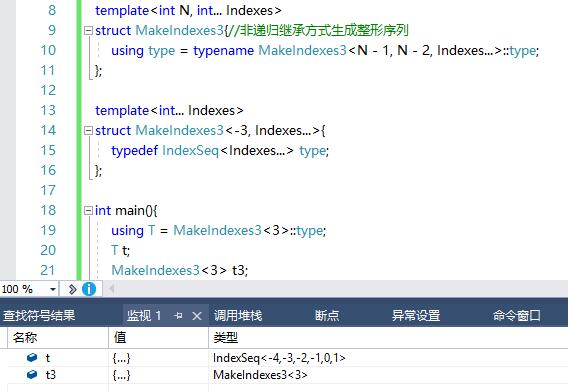
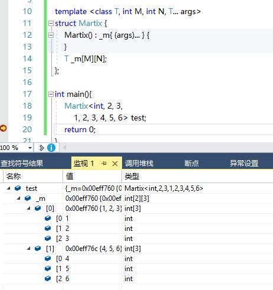

一、可变参数模板函数：
=
>0，声明可变参数只需在typename/class后面带上省略号
```c++
template <class T>
void f(T... args){
    std::cout<< sizeof...(args)<<std::endl;
    //打印变差个数。
}
```
>1，递归函数展开参数包：



>2，逗号表达式展开参数包：





二、可变参数类模板:
=
0，
```c++
template< class... Types >
class tuple;
std::tuple<int, double, string> tp3 = std::make_tuple(1, 2.5, “”);
std::tuple<> tp;//可变参数模板的模板参数个数可以为0个
```

>1，模板偏特化和递归方式展开参数包



>2，继承方式展开参数包




三、使用可变参数模板：
=


>我想写成可变参数构造函数，但是编译报错。应该是构造函数不支持。