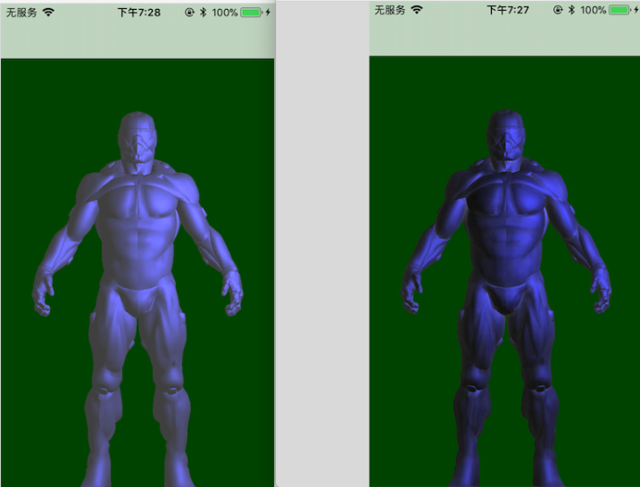

一、
=
环境光被用来模拟散射。在现实中光线会以任意方向散射，所以它的强度受遮挡时是应该会有变化的。间接的光模拟叫做环境光遮蔽（Ambient Occlusion）。

基于ray-tracing的积分计算P点射线有多少被遮挡多少无遮挡。

 


二、SSAO方案:
=
## 1， 弄个半球区域，在半球内随机采样一系列点；再创建一个很小的随机噪声纹理平铺于屏幕上来对半球内的采样点做随机旋转。


## 通过随机采样点和对采样点的微旋转得到一个P点周边的随机点Q，比较P和点集Q的深度值来得到P点的遮蔽因子。


## 上图FragColor是一个float，就是我要的遮蔽因子。使其直接乘以正常光照的环境光强度参数即可。
```c++
    float AmbientOcclusion = texture(ssao, TexCoords).r;
    vec3 ambient = vec3(0.3 * Diffuse * AmbientOcclusion);
```

## 2，整体流程：

* g_buffer获取位置、法线、颜色；
* 噪音纹理对随机采样点做随机旋转，配合g_buffer的位置、法线得到ssao纹理；
* 对ssao纹理做模糊处理，使阴影模糊;
* 再基于后置渲染加ssao纹理一起渲染到屏幕上。


```c++
TexParameteri position(GL_RGB16F, GL_RGB, GL_FLOAT, GL_NEAREST, GL_NEAREST, GL_CLAMP_TO_EDGE, GL_CLAMP_TO_EDGE);
TexParameteri normal(GL_RGB16F, GL_RGB, GL_FLOAT, GL_NEAREST, GL_NEAREST, 0, 0);
TexParameteri albedos(GL_RGB16F, GL_RGB, GL_FLOAT, GL_NEAREST, GL_NEAREST, 0, 0);

TexParameteri ssao(GL_R16F, GL_RED, GL_FLOAT, GL_NEAREST , GL_NEAREST, 0, 0);
//TexParameteri 是我megranate_render里面一个便于glTexImage2D的类。
```

三、结果:
=
