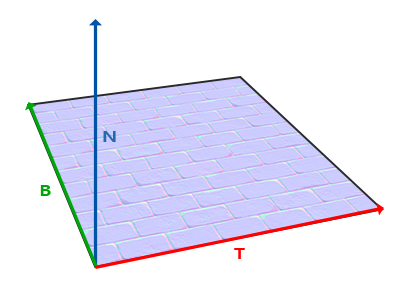
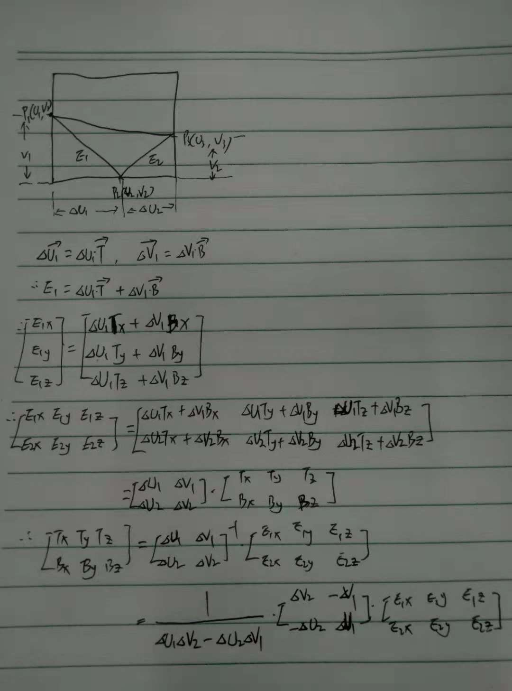

一、
=
法线贴图的法线一般朝Z轴正方向，所以被贴图的模型后脑勺或侧脸的法线不是z轴正方向。因为这两者是在不同的坐标空间，这时计算光照结果就会不对。

在一个不同的坐标空间中，法相贴图的向量总是指向这个坐标空间的z正方向；所有光照向量都相对于这个正方向进行变换。这样就能始终使用同样的法线贴图不管朝向问题。这个坐标空间叫做切线空间（tangent space）。





二、
=

```c++
    glm::vec3 edge1 = pos2 - pos1;
    glm::vec3 edge2 = pos3 - pos1;
    glm::vec2 deltaUV1 = uv2 - uv1;
    glm::vec2 deltaUV2 = uv3 - uv1;
    GLfloat f = 1.0f / (deltaUV1.x * deltaUV2.y - deltaUV2.x * deltaUV1.y);

    tangent1.x = f * (deltaUV2.y * edge1.x - deltaUV1.y * edge2.x);
    tangent1.y = f * (deltaUV2.y * edge1.y - deltaUV1.y * edge2.y);
    tangent1.z = f * (deltaUV2.y * edge1.z - deltaUV1.y * edge2.z);
    tangent1 = glm::normalize(tangent1);

    bitangent1.x = f * (-deltaUV2.x * edge1.x + deltaUV1.x * edge2.x);
    bitangent1.y = f * (-deltaUV2.x * edge1.y + deltaUV1.x * edge2.y);
    bitangent1.z = f * (-deltaUV2.x * edge1.z + deltaUV1.x * edge2.z);
    bitangent1 = glm::normalize(bitangent1);
```

三、
=
# 直接使用TBN矩阵，把切线坐标空间向量转为实在坐标空间
```c++
//有了TBN矩阵我们现在就可以更新法线贴图代码，引入切线到世界空间变换，
//这样所以法线和其它光照变量就在同一坐标系中了。
normal = texture(normalMap, fs_in.TexCoords).rgb;
normal = normalize(normal * 2.0 - 1.0);   
normal = normalize(fs_in.TBN * normal);
```

# 方案二：使用TBN矩阵的逆矩阵 transpose(mat3(T, B, N));，再把lightdir、viewdir等相关向量变换到切线空间，这样每个向量还是在同一个空间中了。
```c++
layout (location = 0) in vec3 aPos;
layout (location = 1) in vec3 aNormal;
layout (location = 2) in vec2 aTexCoords;
layout (location = 3) in vec3 aTangent;
layout (location = 4) in vec3 aBitangent;

    
    mat3 normalMatrix = transpose(inverse(mat3(model)));
    vec3 T = normalize(normalMatrix * aTangent);
    vec3 N = normalize(normalMatrix * aNormal);
    T = normalize(T - dot(T, N) * N);
    vec3 B = cross(N, T);
    
    mat3 TBN = transpose(mat3(T, B, N));    
    vs_out.TangentLightPos = TBN * lightPos;
    vs_out.TangentViewPos  = TBN * viewPos;
    vs_out.TangentFragPos  = TBN * vs_out.FragPos;
        
```

* 方案一需要在片段着色器中采样法线向量并进行空间转化；
* 方案二可以把所以向量在顶点着色器中进行空间转换。
* 光照所需向量只要都在同一空间，计算出来颜色值就都是正确的。
* 顶点着色器通常比片段着色器运行更少，乘法效率更高。