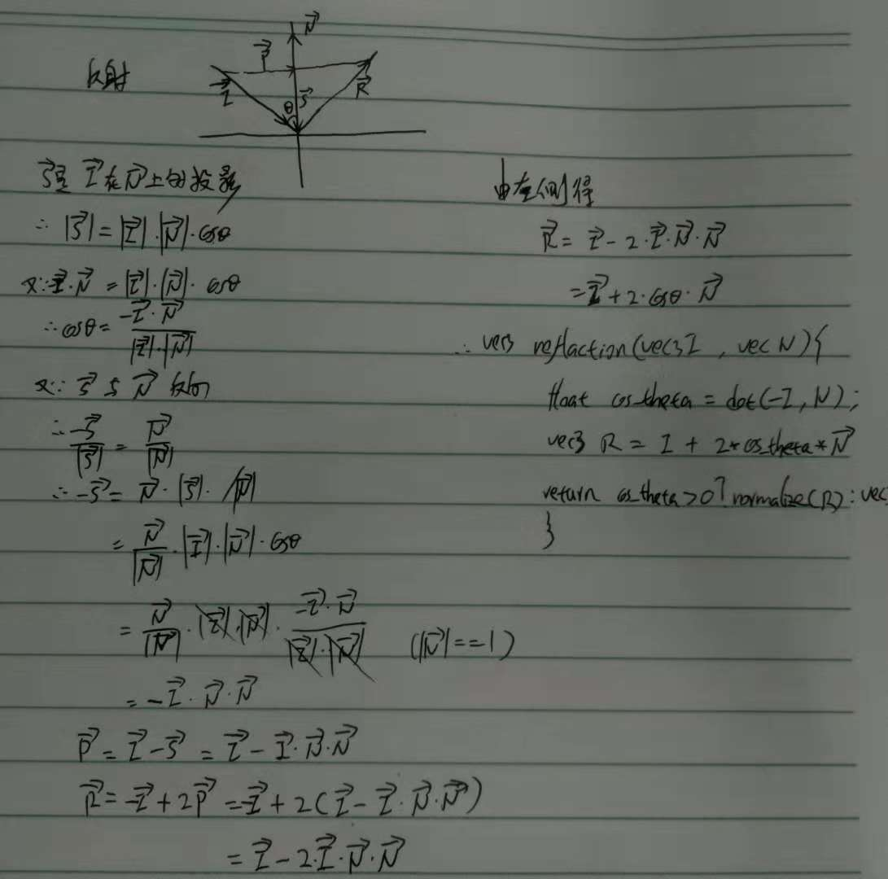
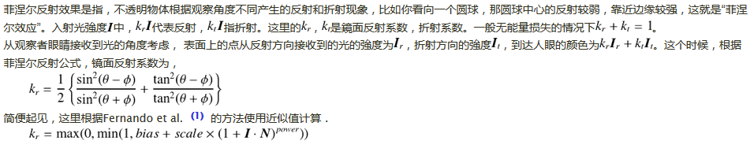

一、反射
=
genType reflect (genType I, genType N)
result = I - 2.0 * dot(N, I) * N.

//S是I在N上投影
|S| = |I|*|N|*COSθ;
COSθ = -I*N/|I|*|N|;-S = |S|*N/|N|;//S与N反向
∴ -S  = -|I|*|N|* I*N*N/|I|*|N|*|N|
      =-N*N*I/|N|*|N|;
N为单位向量则|N|= = 1; S = N*N*I;
P = I - S
  = I - N*N*I;∴ R = -I +2(I-N*N*I);
  = I - 2N*N*I;



二、折射
=


三、菲涅尔效果
=
当光线到达材质交界面时，一部分光被反射，另外一部分发生折射，这个现象被称为Fresnel Effect。
菲涅尔现象混合了反射与折射，使得物体更加真实。
如果你站在湖边，低头看脚下的水，你会发现水是透明的，反射不是特别强烈；如果你看远处的湖面，你会发现水并不是透明的，但反射非常强烈。这就是“菲涅尔效应”。
## 简单的讲，就是视线垂直于表面时，反射较弱，而当视线非垂直表面时，夹角越小，反射越明显。
如果你看向一个圆球，那圆球中心的反射较弱，靠近边缘较强。不过这种过度关系被折射率影响。



```c++ 
uniform float fresnelBias;
uniform float fresnelScale; 
uniform float fresnelPower; 

vec4 FresnelShading(void){
    // 计算入射，反射，折射
    vec3 N = normalize(vNrm);// 法线
    vec3 I = normalize(vPos.xyz-eyePosition);// 入射
    vec3 R = reflect(I, N);// 反射
    vec3 T = refract(I, N, etaRatio);// 折射
 
    // 反射因子计算
    float fresnel = fresnelBias + fresnelScale*pow(min(0.0, 1.0-dot(I, N)), fresnelPower);
 
    // 获得反射环境色
    vec4 reflecColor = textureCube(envmap, R);
    reflecColor.a = 1.0;
 
    // 计算折射环境色
    vec4 refracColor;
    refracColor.rgb = textureCube(envmap, T).rgb;
    refracColor.a = 1.0;
 
    // 颜色合成
    vec4 cout = lerp(refracColor, reflecColor, fresnel);
    cout.a = fresnel*0.5+0.5;
 
    return cout;
}
```